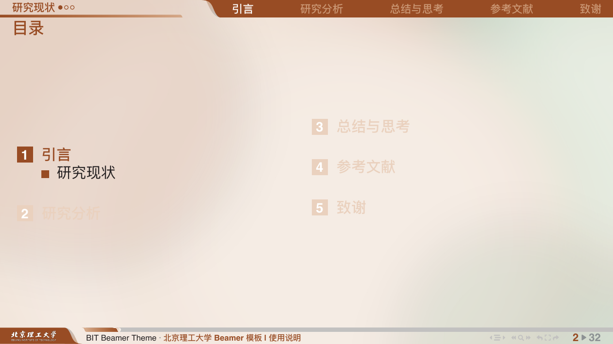

# 北京理工大学 Beamer 模板

[](https://github.com/GtJerry111/bit_theme_beamer)
[](https://github.com/GtJerry111/bit_theme_beamer)
[](https://www.latex-project.org/)

[](https://github.com/GtJerry111/bit_theme_beamer)


## 致谢

本模板基于 [SCU Beamer Theme](https://github.com/FvNCCR228/SCU-Beamer-Theme) 开发，保留了其成熟的页眉页脚设计，并适配北京理工大学的视觉识别系统。

同时感谢 [USTC Beamer Theme](https://github.com/ustctug/ustcbeamer) 和 [THU Beamer Theme](https://github.com/tuna/THU-Beamer-Theme) 提供的设计参考。

## 预览




## 编译依赖

本模板需要以下 LaTeX 宏包（通常已包含在 TeX Live 完整版中）：

- **基础依赖**：`beamer`, `tikz`, `tcolorbox`, `fontspec`, `ctex`
- **参考文献**：`biblatex`, `biber`, `biblatex-gb7714-2015`（GB/T 7714-2015 国标）
- **其他**：`xstring`, `fontawesome5`, `tabularx`

如果使用 TeX Live Basic 或 MiKTeX，可能需要手动安装 `biblatex-gb7714-2015`：

```bash
tlmgr install biblatex-gb7714-2015
```

## 快速开始

### 1. 克隆或下载项目

**Git 克隆:**

```bash
git clone https://github.com/GtJerry111/bit_theme_beamer.git
```

**从 Release 下载:**

前往 [GitHub Releases](https://github.com/GtJerry111/bit_theme_beamer/releases) 下载。

### 2. 创建主 `.tex` 文件

「以下假设主文件命名为 `exp.tex`」创建方式有两种:

- **基于 MWE 修改:** 展开下方 MWE (最小工作示例), 保存为 `exp.tex` 即可编译;
- **参考示例:** 直接参考仓库中的 `main.tex` 或 `main-en.tex` 示例文件创建 `exp.tex`.

<details>
<summary><b>MWE (exp.tex)</b></summary>

```latex
% !TeX encoding = UTF-8
% !TeX TS-program = latexmk
% UTF-8 格式 + latexmk 编译

% ---------------- %
%      导言区      %
% ---------------- %
\PassOptionsToPackage{cmyk}{xcolor}% 解决设置 CMYK 颜色时生成 PDF 的色彩偏移
\documentclass[
  % draft,           % 草稿模式
  % handout,         % 讲义模式
  aspectratio=169, % 演示比例(推荐) 16:9
  hyperref, UTF8, CJK%
]{beamer}

% -------- BIT Beamer Theme Config --------
\usetheme[
	% ColorDisplay=, % BITA ⚙️ | BITB | Custom → 主题色显示设置
	% BlockDisplay=, % colorful ⚙️ | followtheme | allgrey → 区块颜色显示设置
	% CodeTheme=, % listing ⚙️ | minted | minted2 → 代码高亮显示设置
	% MintedStyle=, % lightmode ⚙️ | darkmode | ⟨custom⟩ → minted 样式设置 (需优先设置 CodeTheme = minted | minted2)
	% LanguageMode=, % cn ⚙️ | en → 语言模式设置
	% Miniframes=, % follow ⚙️ | separate | none → 页眉小节迷你帧设置
	% NavigationTool=, % 1-2-3 ⚙️ | ⟨参考 Manual 设置⟩ | none → 页脚导航工具栏设置
	% FontTheme=, % Auto ⚙️ | Ubuntu | Win | Mac | Fandol | Source-Han | ... | Custom → 字体主题设置
	% MathFont=, % LM ⚙️ | XITS | ⟨custom⟩ → 数学字体设置
	% BIBMode=, % biber ⚙️ | none → 参考文献引擎设置
	% BIBStyle=, % biber-gb7714 ⚙️ → 参考文献样式设置 (设置 BIBMode=none 时无效)
	% ContentMuticols=, % true ⚙️ | false → 目录帧双栏显示设置
	% Background=, % BIT-Full ⚙️ | BIT-Lite | Custom | none → 背景显示设置
]{bit}

% -------- Packages --------
% \usepackage[xx]{xx}
\usepackage{multicol, multirow}

% -------- TitlePage Config --------
% [<in footline>]   → 方括号内容, 缩写, 显示在页脚
% {<in title page>} → 花括号内容, 全称, 显示在封面
% ----------------
\title[Short 标题]{Full 标题}
\subtitle{副标题}% subtitle 未设置页脚显示项, 请在 title 中设置.
\author[页脚作者]{作者一\inst{1}\inst{a} \and 作者二\inst{2}\inst{b}}
\institute{%
	\inst{1} 北京理工大学
	\vspace*{-6pt} \and
	\inst{2} ~Institution Two
	\vspace*{-6pt} \and
	\inst{a} \mailbit{author1@example.com} ~\inst{b} \mailbit{author2@example.com}
}
\date{\today}

% ---------------- %
%      正文区      %
% ---------------- %
\begin{document}

\section{第一节}
\subsection{第一小节}
\begin{frame}{帧标题}
	\begin{itemize}
		\item 示例内容一
		\item 示例内容二
	\end{itemize}
\end{frame}

\begin{frame}{帧标题}{帧小标题}
	\begin{columns}
		\begin{column}{.5\textwidth}
			\structure{栏一标题}

			示例内容一

			示例内容二
		\end{column}
		\begin{column}{.5\textwidth}
			\structure{栏二标题}

			示例内容三

			示例内容四
		\end{column}
	\end{columns}
\end{frame}

\subsection{第二小节}
\begin{frame}{公式示例}
	质能方程
	\begin{equation}
		E = mc^2
	\end{equation}
\end{frame}

\section{第二节}
\subsection{动画示例}
\begin{frame}{动画演示}
	\begin{itemize}
		\item<1-> 第一步: 准备工作
		\item<2-> 第二步: 编写内容
		\item<3-> 第三步: 编译生成
		\item<4-> 第四步: 完成!
	\end{itemize}
	\only<4>{\structure{动画演示结束.}}
\end{frame}

% -------- Appendix --------
\appendix
\section{附录}
\subsection{附录}
\begin{frame}{附录}
	附录内容.
\end{frame}

\end{document}
```

</details>

### 3. 导入章节 `.tex` 文件

建议将演示内容按章节拆分到单独的 `.tex` 文件中, 方便管理大型演示文稿.

**在 `include-sec/` 目录下创建各章节文件**, 例如:

```
include-sec/
├── sec-introduction.tex
├── sec-method.tex
└── sec-conclusion.tex
```

> `include-sec/` 是 BIT Beamer Theme 预设的章节 `.tex` 文件存放目录. 本模板通过 latexmk 将编译中间文件 (aux 文件等) 输出至 `tmp/build/`, 而由于 latexmk 迁移 aux 输出目录时出于安全考虑不会自动创建子目录, 本模板已提前在 `tmp/build/` 下创建好对应的子目录.

**每个章节文件只需包含帧内容** (无需 `\documentclass` 和 `\begin{document}`), 例如:

```latex
% include-sec/sec-introduction.tex
\section{引言}
\subsection{背景}
\begin{frame}{研究背景}
    此处填写内容.
\end{frame}
```

**然后在主文件 `exp.tex` 中通过 `\include` 或 `\input` 导入**:

```latex
% 在 \begin{document} 之后
\include{include-sec/sec-introduction}
\include{include-sec/sec-method}
\include{include-sec/sec-conclusion}
```

> **`\include` 与 `\input` 的区别:**
> - `\include` 会自动在前后插入 `\clearpage`, 适合章节级别, 支持 `\includeonly` 选择性编译;
> - `\input` 直接嵌入内容, 不分页, 适合小片段.

### 4. 编译

```bash
latexmk exp.tex
```

### 5. 清理 (可选)

当出现编译异常 (如交叉引用错误、缓存污染) 或需要重新完整编译时, 可清理中间文件:

```bash
latexmk -c            # 清除中间文件
latexmk -c exp.tex    # 清除指定文件的中间文件
latexmk -C            # 清除全部生成文件
latexmk -C exp.tex    # 清除指定文件的全部生成文件
```

> `-c` 仅清除 `.aux`, `.log`, `.toc` 等中间文件, 保留 PDF; `-C` 连同 PDF 一并清除.

> **!! 注意事项:**
> - 在线平台 (如 TeXPage, Overleaf) 编译时, 请上传整个工作文件夹, 否则可能出现因文件缺失导致的编译异常;
> - 模板已内置丰富的配置选项; 如确需修改 `.sty` 文件, 请先了解模板结构, 保留备份后参照文件内注释进行实验性修改;
> - 推荐使用 `latexmk` 编译; 若无法使用 latexmk, 可在编辑器中配置编译引擎为 XeLaTeX, 参考文献引擎为 Biber, 并按 XeLaTeX → Biber → XeLaTeX → XeLaTeX 的顺序编译四轮.


## AI 辅助 (Claude Code Skill)

本模板提供了 [Claude Code](https://docs.anthropic.com/en/docs/claude-code) 专用的 Skill (位于 `skill` 分支), 可辅助编写与修改 Beamer 演示文稿.

### 功能

- 将论文/报告转写为 Beamer Slides
- 从零创建 Slides
- 修改已有 Slides (配色、动画等)
- 辅助配置主题参数
- 排查编译问题

### 使用方式

1. 安装 Claude Code CLI:
   ```bash
   npm install -g @anthropic-ai/claude-code
   ```
2. 安装 [CC Switch](https://github.com/farion1231/cc-switch), 在 Skills 面板中安装本模板的 Skill:
   - URL: `https://github.com/GtJerry111/bit_theme_beamer`
   - 分支: `skill`
3. 在项目目录下启动 Claude Code, 输入 `/beamer-bit` 或用自然语言描述需求即可触发 Skill (如 "帮我用 BIT beamer 做一个答辩 Slides")


## 论文转 Slides (paper2beamer)

本模板已适配 [paper2beamer](https://github.com/Haouo/PaperTalk-IR-Skills) 工具，可将学术论文 PDF 自动转换为 BIT 风格的 Beamer 幻灯片。

### 前置条件

- **paper2beamer skill**：需要在 Codex 中安装 paper2beamer skill。参考 [PaperTalk-IR-Skills](https://github.com/Haouo/PaperTalk-IR-Skills) 仓库。
- **编译工具链**：`xelatex`、`latexmk`、`uv` 需在 PATH 中可用。
- **BIT 主题**：本仓库即为 BIT 主题源码。

### 安装与集成

在 `bit_beamer_theme` 仓库根目录下运行安装脚本：

```bash
./docs/setup-paper2beamer.sh
```

**脚本做了什么：**

1. 检测 paper2beamer 的 ISA 目录（默认 `~/.cc-switch/skills/paper2beamer/isa/`）
2. 将本仓库的 `isa/BIT.yaml` 通过符号链接（symlink）链接到该目录
3. 如果目标已存在旧文件，先删除再创建链接

**效果：** paper2beamer 在生成 slides 时会读取本仓库的 `isa/BIT.yaml`，获取 BIT 主题的完整配置信息。由于使用符号链接，本仓库的 ISA 更新后 paper2beamer 自动生效，无需手动同步。

### 使用流程

1. **在 Codex 中启动对话**，输入类似指令：

```
使用 paper2beamer 将 paper.pdf 转换为 BIT 主题的 slides。
15 分钟的 talk，中文。
```

2. **paper2beamer pipeline 自动执行：**
   - Intent 阶段：根据你的描述确定页数预算（考虑 overlay 膨胀）
   - Ingest 阶段：Docling 提取论文内容和图片
   - Narrative IR → Slide IR → Emission → Compile

3. **验证生成的 slides：**

```bash
# 检查生成的 main.tex 是否包含必需的宏包
grep -c "\\\\usepackage" slides/<slug>/build/preamble.tex

# 检查是否设置了推荐选项
grep "NavigationTool" slides/<slug>/build/preamble.tex

# 编译并检查页数
cd slides/<slug> && latexmk main.tex
grep "Output written" main.log
```

### BIT ISA 提供的配置

`isa/BIT.yaml` 的 `prose` 字段包含以下关键指导：

| Section | 作用 |
|---------|------|
| 自动封面 | BIT 通过 `\AtBeginDocument` 自动生成封面，pipeline 不应生成 S00 title frame |
| 必需的宏包 | 列出 13 个必需 `\usepackage`，确保 preamble 完整 |
| 推荐的 \usetheme 选项 | 推荐 `NavigationTool=1-2-3`、`BIBMode=none` 等 |
| 帧密度与页数预算 | 说明 overlay 膨胀因子，页数按 PDF 物理页计算 |
| 图片命名 | 建议将 Docling 哈希文件名重命名为 `figure-NNN.png` |

### 自定义 paper2beamer ISA 路径

如果 paper2beamer 安装在非默认位置，可以通过环境变量指定：

```bash
PAPER2BEAMER_ISA=/path/to/paper2beamer/isa ./docs/setup-paper2beamer.sh
```

### 故障排除

**Q: 运行脚本提示 "Operation not permitted"**
A: 检查 paper2beamer ISA 目录的写权限。如果是 Codex skill 目录，可能需要在终端中手动运行。

**Q: 生成的 slides 封面是白底**
A: 确认 `isa/BIT.yaml` 已正确链接。运行 `ls -l ~/.cc-switch/skills/paper2beamer/isa/BIT.yaml` 检查符号链接是否指向本仓库。

**Q: 编译报错 `\beamer@bit@authorbox already defined`**
A: 确认使用的是最新版本的 `beamerinnerthemebit.sty`（已修复此 bug）。

**Q: 页数远超预期（如 15 分钟 talk 生成了 46 页）**
A: 检查 frame 中是否使用了大量 overlay（`\item<1->` 等）。每个 overlay 产生一个独立 PDF 页。ISA 已包含 overlay 膨胀说明，agent 应在 Intent 阶段考虑此因素。


## 模板设计

### 背景

封面与正文板块采用不同背景, 正文背景采用低透明度淡色, 增强正文文本等辨识性; verify 仅用于封面页, 不参与小节目录背景或页脚装饰.

### 页眉

采用双行设计;

首行为节标题导航栏, 显示幻灯整体思路, 还附带北京理工大学校名;

次行为标题栏, 左侧显示小节标题与迷你帧(圆点)形式的当前小节帧进度, 右侧显示当前幻灯标题. (编者认为小节迷你帧能在较清晰呈现进度的同时, 节约大量空间, 也能避免某节中幻灯页数过多, 导致标题导航挤压溢出)

### 页脚

采用双行设计;

首行为导航栏, 左侧显示报告标题, 右侧为导航模块; 次行为信息行, 左中右分别为作者、机构、日期与页码.

### 环境

模板定义了丰富的环境支持:

- **14 个定理环境**：theorem, lemma, corollary, proposition, definition, property, example, remark, algorithm, proof, axiom, condition, conclusion, assumption
- **代码高亮**：支持 listing（默认）和 minted（需安装 Pygments）两种高亮引擎
- **多种字体方案**：Auto（自动检测）、Ubuntu、Win、Mac、Fandol、Source-Han、ZhongYi 等
- **双栏目录**：支持 `\tableofcontents` 双栏显示
- **Overlay 动画**：支持 `\pause`、`\only`、`\onslide` 等逐步展示效果


### 关于修改

若有修改意见欢迎邮件联系编者: zirui.chen1214@qq.com

若本校的 LaTeX 大佬百忙之中能对本模板提出批评指正, 鄙人在此万分感谢各位的支持.

感谢模板中所使用部分代码的原作者, 也感谢模板所调用宏包的诸位作者前辈.

欢迎友校的朋友们对此模板进行修改, 不过这个模板可能有点点难改, 希望能看懂我的注释, 但愿吧.


## 更新记录

### v2.1g (2026-06-26)
- 重新设计封面底栏图形与标题布局
- 添加 `overflowguard` 选项用于 paper2beamer 集成
- 修复封面元素间距和视觉对齐

### v2.1e (2026-06-16)
- 修复 draft 模式下文件名下划线导致的编译错误
- 统一选项命名规范

### v2.1c (2026-05-20)
- 字体主题独立为 `beamerfontthemebit.sty`
- 使用曲线函数重绘页眉页脚图形
- 支持自定义 VI（视觉识别系统）
- 添加多种字体方案（Ubuntu/Win/Mac/Fandol/Source-Han）

### v2.1b (2025-10-06)
- 优化页眉页脚间距
- 使用 picture 环境替代 tikz 环境定位

### v1.3e (2024-10-31)
- 迷你帧布局移至外部主题
- 改进 cleveref 中文支持

### v1.3d (2024-05-18)
- 改进 minted 代码高亮支持

### v1.3c (2024-04-16)
- 内部主题独立为 `beamerinnerthemebit.sty`
- 页眉页脚与 TikZ 绘图合并

### v1.0a (2021-12-03)
- 初始版本，基于 SCU Beamer Theme 派生
